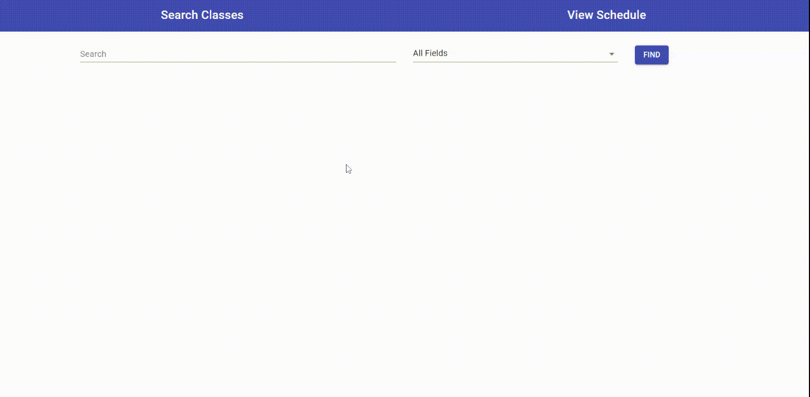

## Introduction

Schedule Builder, as the name implies, is an application for building schedules. It was built using ReactJS, Material UI, and Firebase. The home page has a search feature that returns all the CSE classes at Stony Brook University for Spring 2021. The student can click on the add button to add the class to the schedule. 

## Demo

## Available Scripts

In the project directory, you can run:

### `npm start`

Runs the app in the development mode. 
Open [http://localhost:3000](http://localhost:3000) to view it in the browser.

The page will reload if you make edits. 
You will also see any lint errors in the console.

